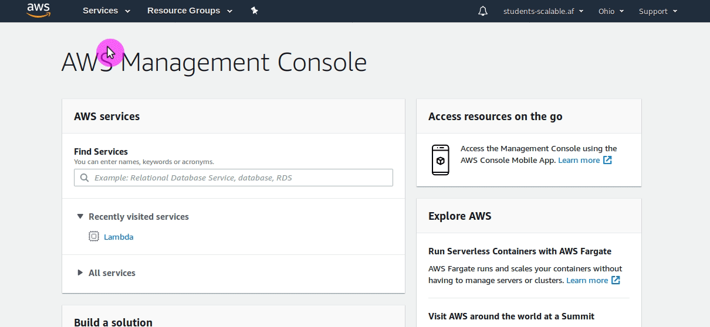
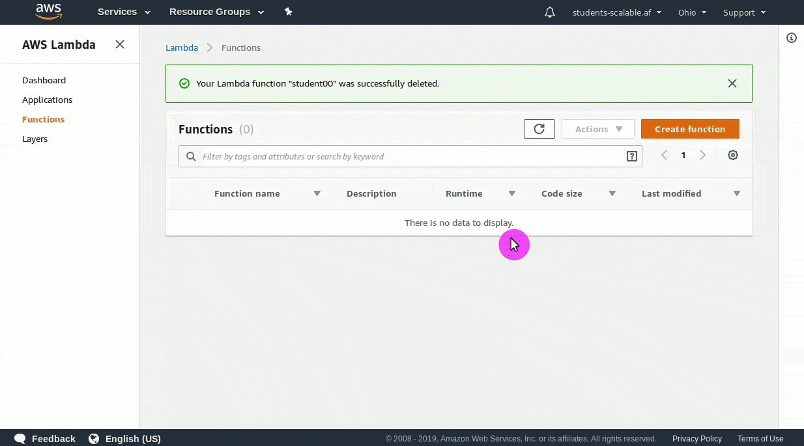

# Lab 1.1 - Creating our first Lambda function

- Log into the AWS Management Console
- Find the Lambda managed console
- Create a function using a blueprint
- Test your function

## Steps

1. Log into the AWS console, either your own or the login link provided by your instructor.

2. Once logged in you need to get to the Lambda service. You can do this multiple ways: 
    - The easiest and most consistent way to accomplish this with the UI is to click on the "Services" in the upper left of the management console.
    - Then type `lambda` in the search box that comes up in the middle. 
    - Select Lambda on the list of services shown after searching.
      
      
      
        
    
    
    
3. From here we can create our first Lambda function.
    - Click on `Create function` to access the function create UI
    - Select `Use a blueprint`
    - Search for `hello-world-python` and click on the blueprint.
4. All functions require some basic information. They need to be unique within the account and have a role associated with them.
    - Give your function a unique name, `student{id}` such as `student100` depending on the ID you were given for the course or create a unique name if using your own account. Remember this, as we will use this naming format throughout the class.
    - Under `Execution role` select the option `Create a new role with basic Lambda permissions`.
    - Below the blue information box letting you know the role will take a few minutes to create it will tell you the name of the role that was created.
    - Scrolling down you can see the code that will be used for the blueprint. You can't modify the blueprint, but after creating the function we will be able to modify it.
    - Scroll to the bottom and click on `Create function`.  
      

        

#### Congratulations, you have just created your first Lambda function. Now lets give it a quick test.

# Running our first Lambda function

*There is a lot of information and configuration options available in the management console on the function page for the function we have just created. We will work our way through them throughout the rest of this course, for now we will skip over most of that and go straight to running our function once to get a feel for it.*

1. Click on the `Test` button in the upper right hand corner of the management console for your function.
2. Use the default selected `Hello World` test template.
3. Give your test event any name you would like.
4. Look at the test event data. This is generated to match the blueprint we selected, so it shouldn't be modified, but be aware that you are able to configure the data for future more complex tests.
5. Click on `create`
6. Your test event has been created. The drop down box next to the `Test` button now has your test event saved for re-use.
7. Select the test event you created and click on `Test` again.
8. You should see a green success message. Clicking on `Details` will give you the results of the test run, including how long it ran, if it was successful or not, and the log output.
9. In the log output area you will see the test data that we fed into the function using the test event.
    

# Congratulations, you have successfully tested your first Lambda function.
It may not seem like much, but we have just created and tested our first Lambda function. We will build on this concept using the command line in future labs. Occasionally, we will reference things in the UI and make some modifications. As we go through that the various components of the UI will be explained in greater detail. There is a lot to take in, so we will break it up over multiple labs, to make it easier to consume.