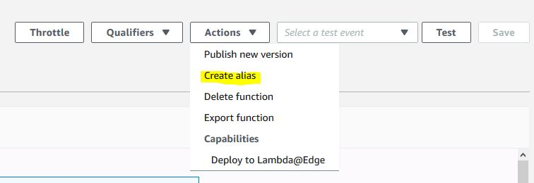
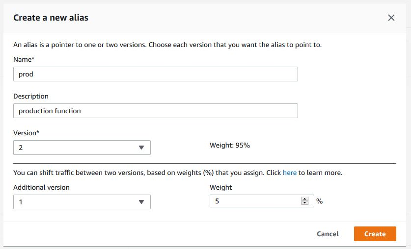
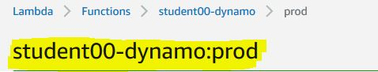
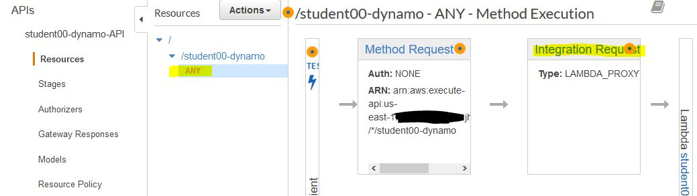
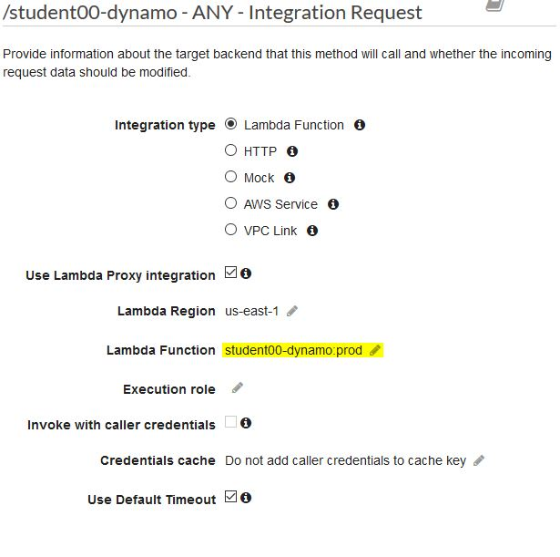

# Lab 1.6 - Deploy a new comment rendering function with a canary

We are going upload a new version of our comments function, create an alias for it and associate the API Gateway with it.

- We will use a lambda function to:
    - Receive form submissions.
    - Add them to a Dynamo DB table.
    - Trigger a rebuild when new entries are made in the DynamoDB
    - Inject our comments into our posts before they are compiled and uploaded.

## Steps

1. Update our `comments-get` code to enable the new comment formatting.

    
    -  In the `lambda` folder, run:

        ```sh
        rm function.zip && zip -r function.zip .
        ```

        And update your function with the new code:

        ```sh
        aws lambda update-function-code --function-name {FUNCTION_NAME - ex. student00-comments-get} \
        --zip-file fileb://function.zip
        ```

2. Create an `API Gateway` for our `studentID-comments-get` function
    - You can create an `API Gateway` via the CLI, but it is a long drawn out process that we will simply be using the SAM/Serverless frameworks for tomorrow. For simple services and applications, using the UI works well. Create an `API Gateway` for your `studentID-comments-get` function similar to what you did in lab 1.3 when setting up the initial webhook.
    - *Remember the API Endpoint, you will need it later*
  
3. Now we need to create the alias
   - Go back to the AWS management console and go to your specific comments function. Near the top there is a button labeled `Actions`.
   - Click it, then select `Create alias`
  
     
    - The `Create a new alias` dialog is displayed. Give your alias a name e.g. `prod` we will use this later so be sure to remember it.
    - Under `version` select the version you just uploaded from the drop down
    - Select the previous version of `Additional version` and set the weight to `50`

      
      *This will create an alias where half of the traffic will randomly go to the old version or the new version*
    - Click on `Create`

4. Notice that the function name has changed, it now includes the alias.
    - We will use this exact name, including the alias to update the API gateway
        

5. Open the `API Gateway` console to modify the gateway for your function
   - You can click on the `API Gateway` integration from the function or open it directly and find your API.
   - Select your resource, and click on `ANY`
   - Select the `Integration Request` to access the specific `Lambda Proxy` settings for that method
     
    - Next to the `Lambda Function` option click on the pencil to edit the name
    - Use the name of your function **and** the name of the alias
    
    - Save your changes
    - *If we created the alias before creating the API Gateway, the gateway would have by default used the alias, but we did it this way to familiarize ourselves with how to modify API/Proxy integrations*

6. Now we can curl our API endpoint to test what we get back for comments
   - Curl the endpoint to see what the response is, run it mulitple times to get a different response with an average 50% of each.
        ```sh
        curl {API_ENDPOINT eg. student00-comments-get} --data '{"name": "first-post"}' 
        ```
    - You should see a response with or without the `Name: ` attribute added to it.
