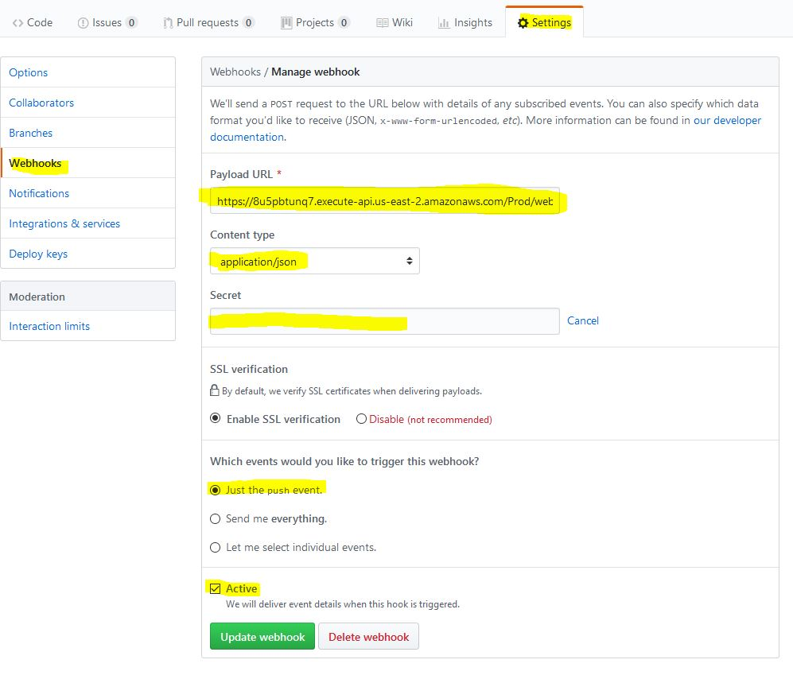
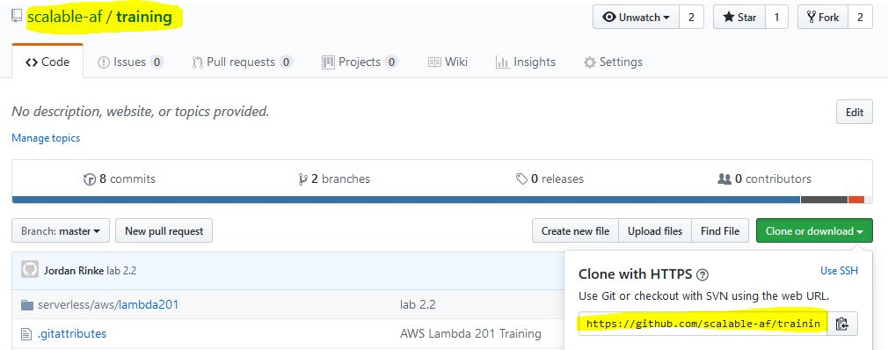
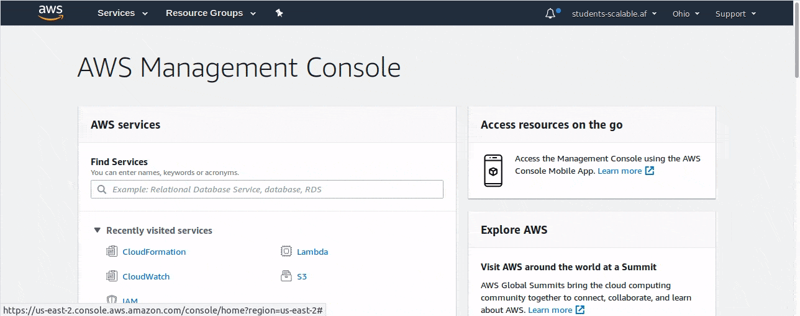

# Lab 2.2 - Deploy our GitHub listener and static site pipeline with AWS SAM

- Modify the template
- Build the dependencies for the functions
- Package the CloudFormation template
- Deploy it all from a single command via the CLI with a template file.

## Steps

1. Re-deploy your hugo blog. In the `source/blog` folder there is a new copy of our blog. Replace the contents of your current repo with this just to make sure we are configured correctly.

2. Edit `source/sam/template.yaml`
    - We need to change a few lines, everything else is built into the template for us.

    - Line 38 - Replace `secret` with the github secret you set up.
    ```yaml
    github_secrets: secret
    ```
    Reminder on where the secret is in Github and the settings you should have set
    

    - Line 155 and 156 - Put in your Github repos full name, and https URL
    ```yaml
    full_name: {YOUR_REPO_NAME e.g. student00/blog}
    clone_url: {YOUR_HTTPS_CLONE_URL e.g. https://github.com/scalable-af/training.git}
    ```
    

3. Build the template using containers.
    - In lab 1.4 and 1.5 we had dependencies built into our function. This has some issues, specifically if you make any modifications or add dependencies with different versions of python.
    - AWS SAM has an option to build your functions, with Lambda containers, and pull in any specific requirements. This keeps our code cleaner. Instead of having a few megs of dependencies in our source control now we just have a requirements.txt file.
    - Build with containers from the `sam` folder
    ```sh
    sam build --use-container 
    ```
    You should see a build process happen for every function. It will take a minute and then eventually you should see  
    `Build Succeeded`

4. We need to package it up to s3 again. You can use the same bucket you used in lab 2.1
    - Run the SAM Package command
    ```bash
    sam package \                                                                                               --output-template-file packaged.yaml \
            --s3-bucket {YOUR_BUCKET}
    ```

5. The template and all of the zipped up files have been uploaded to s3, we can now trigger CloudFormation
    - Run SAM deploy - change student00 to your student ID.
    ```sh
    sam deploy \                     
            --template-file packaged.yaml \
            --stack-name student00-blog-stack \
            --capabilities CAPABILITY_IAM
    ```
    - This will take a few minutes to run, you can wait on the CLI to return or you can take a look at the progress in the CloudFormation management console. If you are logged in already and you can click [https://us-east-2.console.aws.amazon.com/cloudformation/home](https://us-east-2.console.aws.amazon.com/cloudformation/home). Switch to whatever region you are using if it isn't us-east-2.
    - Click on the stack name you created, you can see the resources that are being created.

6. Test our new application.
    - Click on your stack in the CloudFormation management console.
    - Click on `Outputs`
    - You should see a `WebsiteURL` this is the URL to view our site.
    - `HugoBlogWebhook` is what you need to set your Github webhook to now.
    - `HugoBlogComments` is what you need to set in `blog\config.toml`
        ```ini
        [params.lambdaComments]
        endpoint = "http://the-url-to-our-lambda-API-Gateway"
        ```
    
7. You can also get all of the endpoint URLs using the command line
    ```sh
    aws cloudformation describe-stacks \
    --stack-name {YOUR_STACK_NAME} \
    --query 'Stacks[].Outputs[]' \
    --output table
    ```
7. Once you change the webhook url in github, and then change the url on config.toml and commit it, you should see the blog get created/updated.
    - If you try to go to the WebsiteURL before doing a push nothing will be there, CloudFormation created a new bucket for this stack.

8. You should be able to submit a comment, and see it show up after a minute.

# Congratulations. What took us hours to do yesterday takes only a few minutes thanks to using a AWS SAM template.